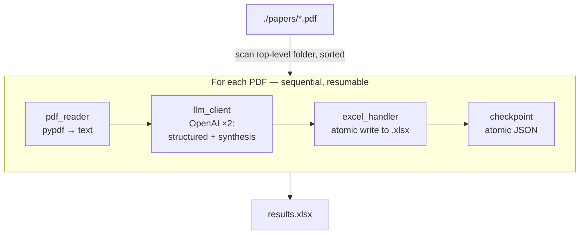

# extractkit

[](https://github.com/KasraAlizadeh/extractkit/actions/workflows/ci.yml)
[](https://www.python.org/downloads/)
[](https://github.com/astral-sh/ruff)
[](https://mypy-lang.org/)
[](LICENSE)

**LLM-powered toolkit to extract structured data from PDFs into Excel using a schema-first approach.**

Built for systematic literature reviews and document-automation pipelines. `extractkit` reads a folder of PDF articles, asks OpenAI to find the fields you care about, and appends one neatly-typed row per document into a pre-templated Excel workbook — incrementally, atomically, and resumably.

---

## Why this exists

Systematic literature reviews are bottlenecked on a tedious step: reading dozens or hundreds of papers and copying the same handful of fields (year, methodology, sample size, KPIs) into a spreadsheet. `extractkit` automates that step for any research domain whose review template can be expressed as a set of Excel column headers.

The first use case it was built for is thermal comfort / ASHRAE-55 / urban heat island research, but the schema is supplied at runtime, so the same pipeline works equally well for clinical trial extractions, due-diligence reviews, contract triage, or any other "PDF to schema-defined row" task.

## Highlights

- **Schema-first.** Excel column headers *are* the extraction schema. Edit the template, the LLM follows.
- **Two-pass extraction.** Pass 1 pulls structured fields with strict JSON-schema validation. Pass 2 produces summary fields. Different fields, different prompting styles.
- **Resumable.** Atomic JSON checkpoint + atomic Excel writes. Kill the process at PDF #73 of 100, re-run, it picks up at #74. No re-billing for work already done.
- **Per-document failure isolation.** One corrupted PDF does not abort the run; it is logged, recorded in the checkpoint, and the loop continues.
- **Cross-platform CLI.** Built with Typer; works on macOS, Linux, and Windows.
- **Production-grade tooling.** Ruff for lint and format, mypy in strict mode for types, pytest with coverage, pre-commit hooks, and GitHub Actions CI on Python 3.12 and 3.13.

## Quickstart

```bash
# 1. Clone and enter the project
git clone https://github.com/KasraAlizadeh/extractkit.git
cd extractkit

# 2. Install dependencies (uv handles the venv automatically)
uv sync

# 3. Set your OpenAI API key
cp .env.example .env
# then edit .env and paste your real key

# 4. Run extraction
uv run extractkit \
    --pdfs ./papers \
    --template ./template.xlsx \
    --output ./results.xlsx
```

The first run processes every PDF in `./papers`. Re-running the same command automatically resumes from a checkpoint — already-processed files are skipped, only new ones get extracted.

## CLI reference

```text
Usage: extractkit [OPTIONS]

  Extract structured data from a folder of PDFs into an Excel workbook.

Options:
  -p, --pdfs        DIRECTORY  Folder containing the PDF articles to process.  [required]
  -t, --template    FILE       Excel template whose header row defines the schema.  [required]
  -o, --output      PATH       Where to write the filled workbook.  [required]
  -c, --checkpoint  PATH       Checkpoint JSON path. Defaults to '<output>.checkpoint.json'.
  -s, --sheet       TEXT       Worksheet name to use. Defaults to the active sheet.
  -v, --verbose                Enable debug-level logging.
      --help                   Show this message and exit.
```

## How it works



Every successful PDF appends one row to the output workbook and is marked done in the checkpoint. Failures are recorded but never abort the run.

## Project layout

```text
extractkit/
├── .github/workflows/ci.yml   # GitHub Actions: lint, type-check, test (3.12 & 3.13)
├── src/extractkit/
│   ├── cli.py                 # Typer CLI entry point
│   ├── config.py              # Typed settings (pydantic-settings)
│   ├── schemas.py             # Pydantic models — the 33-column schema
│   ├── pdf_reader.py          # PDF → text (pypdf)
│   ├── excel_handler.py       # Atomic incremental Excel writer (openpyxl)
│   ├── llm_client.py          # OpenAI client with structured outputs + retries
│   ├── extractor.py           # Orchestrator
│   ├── checkpoint.py          # Atomic JSON checkpoint for resumability
│   └── exceptions.py          # Custom exception hierarchy
├── tests/                     # 35 tests, ~71% coverage
├── pyproject.toml             # Single source of truth (deps, ruff, mypy, pytest)
└── .pre-commit-config.yaml    # Pre-commit hooks
```

## Development

```bash
# Install dev dependencies and the pre-commit hooks
uv sync --dev
uv run pre-commit install

# Run the full quality bar locally
uv run ruff format .
uv run ruff check .
uv run mypy src tests
uv run pytest
```

The exact same commands run in CI on every push.

## Tech stack

| Concern         | Choice                                                              |
| --------------- | ------------------------------------------------------------------- |
| Language        | Python 3.12+                                                        |
| Package manager | [uv](https://docs.astral.sh/uv/)                                    |
| CLI             | [Typer](https://typer.tiangolo.com/)                                |
| Validation      | [Pydantic v2](https://docs.pydantic.dev/) + pydantic-settings       |
| LLM             | OpenAI structured outputs (`beta.chat.completions.parse`)           |
| Retries         | [tenacity](https://tenacity.readthedocs.io/) — exponential backoff  |
| PDF             | [pypdf](https://pypdf.readthedocs.io/)                              |
| Excel           | [openpyxl](https://openpyxl.readthedocs.io/)                        |
| Lint and format | [Ruff](https://docs.astral.sh/ruff/)                                |
| Type checking   | [mypy](https://mypy-lang.org/) (strict mode)                        |
| Testing         | [pytest](https://docs.pytest.org/) + coverage + mocking             |
| CI              | GitHub Actions, matrix on Python 3.12 and 3.13                      |

## License

MIT — see [LICENSE](LICENSE).
